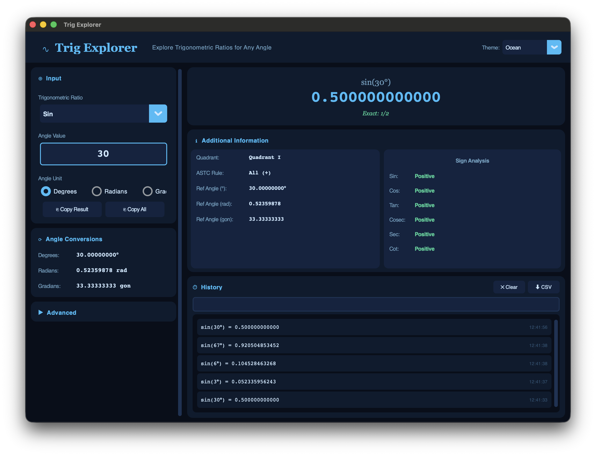

# ∿ Trig Explorer

> **Explore Trigonometric Ratios for Any Angle — instantly, beautifully.**

A polished, production-quality desktop application for computing and exploring all six trigonometric ratios for any angle. Built with Python 3.13+ and CustomTkinter.


---

## Features

### Core
- **All six trig ratios** — Sin, Cos, Tan, Cosec, Sec, Cot
- **Any angle** — decimals, negatives, angles > 360°, non-standard angles
- **Three input units** — Degrees, Radians, Gradians (select via radio buttons)
- **Live updating** — results refresh as you type, no button needed
- **12 decimal place precision** for all calculated values
- Used claude.ai to enhance the working of the project

### Angle Conversions
- Instant conversion display in all three units (Degrees, Radians, Gradians) with 8 decimal places

### Additional Information Panel
- **Quadrant** — Quadrant I / II / III / IV, or "On Axis"
- **ASTC Rule** — which ratio families are positive in that quadrant
- **Reference Angle** — displayed in degrees, radians, and gradians
- **Sign Analysis** — per-ratio positive/negative/axis status for all six ratios

### Advanced Panel (collapsible)
- **Exact Special Values** — e.g. `sin(30°) = 1/2`, `tan(45°) = 1`, `cos(60°) = 1/2`
- **Periodicity** — e.g. `sin` → 360°, `tan` → 180°
- **Unit Circle Normalisation** — e.g. 390° → 30°, -30° → 330°

### History
- Stores up to 50 most recent calculations
- Newest entries appear at the top
- **Searchable** — filter history in real time
- **CSV export** — save the full history to a `.csv` file

### Copy Features
- **Copy Result** — copies the raw decimal value to clipboard
- **Copy All** — copies a formatted block with ratio, angle, all units, value, and exact form

### Themes
You now get **6 themes** in a dropdown in the header:

| Theme | Vibe |

|-------|------|

| **Midnight** | Deep navy/purple |

| **Aurora** | Dark forest green with teal glow |

| **Crimson** | Dark red with orange fire |

| **Ocean** | Deep blue with sky blue accents |

| **Sunlight** | Warm parchment light mode |

| **Arctic** | Clean ice-white light mode |

### Undefined Handling
Gracefully displays `"Undefined"` (in red) instead of crashing for:
- `tan(90°)`, `tan(270°)` — cos = 0
- `cot(0°)`, `cot(180°)` — sin = 0
- `sec(90°)`, `sec(270°)` — cos = 0
- `cosec(0°)`, `cosec(180°)` — sin = 0

### Keyboard Shortcuts
| Shortcut | Action |
|----------|--------|
| `Ctrl+C` | Copy result value |
| `Ctrl+Shift+C` | Copy all data |
| `Ctrl+H` | Clear history |
| `Ctrl+E` | Export history to CSV |

---

## Folder Structure

```
trig_explorer/
│
├── main.py          # Entry point — run this
├── ui.py            # Full CustomTkinter UI (layout, panels, theming)
├── trig_engine.py   # Core trig computation engine (TrigResult dataclass)
├── conversions.py   # Unit conversion helpers (deg/rad/grad)
├── history.py       # History manager + CSV export
├── constants.py     # Themes, special angle table, ASTC, periodicity
├── requirements.txt
└── README.md
```

---

## Installation

### Prerequisites
- Python 3.10 or higher (3.13+ recommended)
- pip

### Steps

```bash
# 1. Clone or download the project
git clone https://github.com/Saharsh000/trig-explorer.git
cd trig-explorer

# 2. (Optional) Create a virtual environment
python -m venv venv
source venv/bin/activate        # macOS/Linux
venv\Scripts\activate           # Windows

# 3. Install dependencies
pip install -r requirements.txt

# 4. Run the app
python main.py
```

---

## Usage

1. **Select a ratio** from the dropdown (Sin, Cos, Tan, Cosec, Sec, Cot)
2. **Type an angle** in the entry field (e.g. `31`, `127.52`, `-30`, `450`)
3. **Choose the input unit** using the radio buttons (Degrees / Radians / Gradians)
4. Results update **instantly** as you type
5. Click **▶ Advanced** to reveal exact values, periodicity, and unit-circle info
6. Use **⬇ CSV** in the history panel to export your session

---

## Examples

| Expression | Result |
|------------|--------|
| `sin(31°)` | `0.515038074910` |
| `tan(127.52°)` | `-1.296263...` |
| `cos(359.1°)` | `0.999985...` |
| `sec(450°)` | `Undefined` (cos=0 at 90°) |
| `cot(-30°)` | `-1.732050808...` |
| `sin(30°)` | `0.5` — Exact: **1/2** |
| `tan(45°)` | `1.0` — Exact: **1** |

---

## Future Improvements

- [ ] Graph plotting (sin/cos/tan from 0° to 360°) using Matplotlib
- [ ] Inverse trig functions (arcsin, arccos, arctan)
- [ ] Complex number support
- [ ] Exportable session report (PDF)
- [ ] Angle input via unit-circle click
- [ ] Multi-language support

---

## License

MIT License. Free to use, modify, and distribute.

---

*Built with Python & CustomTkinter — a GitHub portfolio project.*
